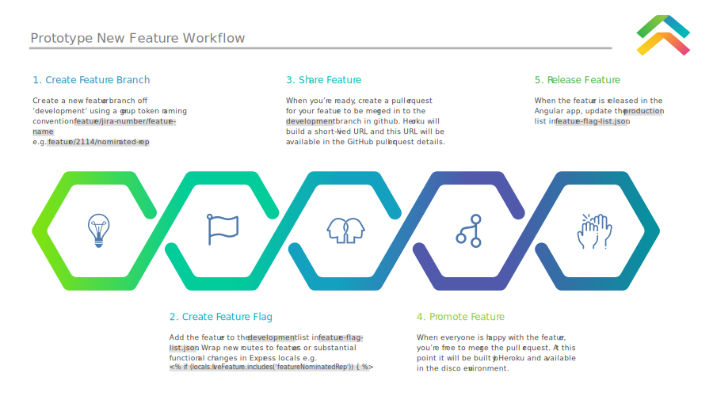

## Prototype
Derived from the Digital Transformation Agency's UI-Kit 2.0, myservice-prototype is a repository for enabling the transformation of UI into React components.

Install Gulp CLI

 `npm install --global gulp-cli`

Run

`npm install`

`gulp serve`

Open a browser at [http://localhost:5000/](http://localhost:5000/)

Problems with the server? Run:
killall node

## Code style and quality
Before contributing to the codebase, please familiarise yourself with [Google HTML/CSS Style Guide](https://google.github.io/styleguide/htmlcssguide.html). This is the style guide we've decided to adhere to.

[BEM](http://getbem.com/introduction/) is the CSS and HTML naming conversion that all new code should adopt.

Install a sass linter e.g. [Sass Lint](https://marketplace.visualstudio.com/items?itemName=glen-84.sass-lint). The .sasslintrc file in this project has been configured to reflect the Google style guide. 

## Contributing 
Please follow the below process for new features or significant changes

## Feature flags
The `./feature-flag-list.json` contains a list of future features. Any feature added to the **production** array will be seen in [demo](http://myservice-demo.herokuapp.com/) and any feature added **development** will be seen in [disco](http://myservice-disco.herokuapp.com/). To create new features, an ejs if statement is needed e.g. ` <% if (locals.liveFeature.includes('featureLsa')) { %> ` in the ejs file. 